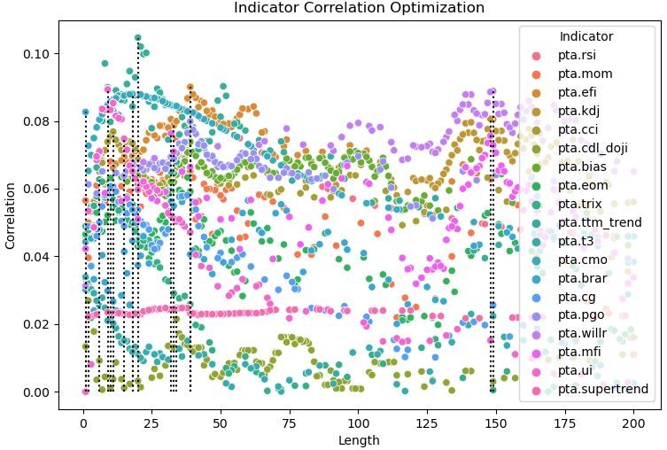
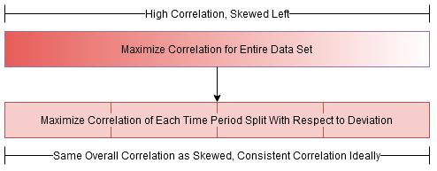

<p align="center">
  <a href="https://github.com/jmrichardson/tuneta">
    
  </a>
</p>

TuneTA optimizes a broad set of technical indicators to maximize its correlation to a user defined target variable.  The set of tuned indicators can be reduced by choosing the most correlated with the target while minimizing correlation with each other. TuneTA maintains its state to add each tuned indicator to multiple data sets (train, validation, test).

### Features

* Given financial prices (OHLCV) and a target variable such as return, optimizes technical indicator parameters to maximize the correlation to the target variable.
* Select top x optimized indicators with most correlation to return with the least correlation to each other
* Persist state to generate identical indicators on multiple datasets (train, validation, test)
* Split multi-objective optimization
* Early stopping
* Correlation report of target and features
* Parallel processing
* Supports technical indicators produced from the following packages
  * [Pandas TA](https://github.com/twopirllc/pandas-ta)
  * [TA-Lib](https://github.com/mrjbq7/ta-lib)
  * [FinTA](https://github.com/peerchemist/finta)

### Overview

TuneTA simplifies the process of optimizing technical indicators and selecting the best (measured by correlation) while minimizing the correlation between each other (optional).  Generally speaking, machine learning models perform better when provided informative inputs that are not strongly intercorrelated.  At a high level, TuneTA performs the following steps:

1.  For each indicator, use an intelligent algorithm to find the best parameters which maximizes its correlation to the user defined target (ie next x day return).  TuneTA supports parameter optimization across multiple time periods.  Note the target can be a subset of X which is common for financial labeling such as with [Triple Barrier Labels](https://towardsdatascience.com/financial-machine-learning-part-1-labels-7eeed050f32e).
2.  Optionally, the tuned parameters can be reduced by selecting the top x indicators measured by correlation, then selecting the least intercorrelated.
3.  Finally, TuneTA will generate each indicator with the best parameters

To illustrate using a toy example, 19 indicators from Pandas-TA are optimized using the "length" parameter (constrained by "length" parameter to graph in 2D).  The dotted black line indicates the "length" that optimizes the given indicator (max correlation to next day return).  Internally, TuneTA uses [Optuna](https://optuna.org) to efficiently search for the optimal "length" value:

<p align="center">
  <a href="https://github.com/jmrichardson/tuneta">
    
  </a>
</p>

The following chart shows that of the top 10 strongest correlated indicators, 5 are selected which are the least correlated with each other (10 and 5 are user defined).

<p align="center">
  <a href="https://github.com/jmrichardson/tuneta">
    
  </a>
</p>

### Multi-Time Period Optimization

TuneTA supports the optimization of parameters over an entire dataset or split into multiple time periods.  Technical indicators may not perform consistently across larger time frames due to market fluctuation.  Optimizing technical indicators over distinct time periods can help avoid correlation skew while providing insight into inconsistent performance.  TuneTA uses multi-objective optimization (pareto optimal) to maximize correlation in each time period with respect to deviation.

The figure below illustrates the possibility of achieving high indicator correlation at the expense of inconsistency across the entire dataset (initial high correlation attenuating over time).  Splitting the dataset into parts and maximizing each split with the same set of parameters could potentially provide more consistent correlation.  Note, indicator parameters do not differ across splits, rather tuneta tries to select parameter(s) which provide maximum correlation to the target while minimizing deviation of all splits.  Note, multi-time period optimization may yield lower overall correlation as it tries to minimize variance especially over longer time periods. 

<p align="center">
  <a href="https://github.com/jmrichardson/tuneta">
    
  </a>
</p>

### Early Stopping

Early stopping can be enabled to limit the number of optimization trials due to resource and time constraints:

* Single time period optimization:  Stop after x number of trials performed without improvement in correlation.
* Multi-time period optimization:  TuneTA finds the best non-dominated candidates of trials to maximize correlation of all time periods along the pareto-front.  A second pareto is generated among theses candidates to minimize deviation with respect to correlation within a pre-defined epsilon.  Stop if there are no changes in the best trial after x number of trials.

### Installation

Install the latest code(recommended):

```python
pip install -U git+https://github.com/jmrichardson/tuneta
```

Install the latest release:

```python
pip install -U tuneta
```


### Example Usage

```python
import yfinance as yf
import pandas as pd
from pandas_ta import percent_return
from tuneta.tune_ta import TuneTA
from sklearn.model_selection import train_test_split
import numpy as np


if __name__ == "__main__":
    # Download data set from yahoo, calculate next day return and split into train and test
    X = yf.download("SPY", period="10y", interval="1d", auto_adjust=True)
    y = percent_return(X.Close, offset=-1)
    X_train, X_test, y_train, y_test = train_test_split(X, y, test_size=.3, shuffle=False)

    # Initialize with 2 cores and show trial results
    tt = TuneTA(n_jobs=2, verbose=True)

    # Optimize indicators
    tt.fit(X_train, y_train,
                   # Indicators to tune / optimize
                   # ":1" means optimize column index 1 vs default 0 if indicator returns dataframe
                   indicators=["tta.MACD", "tta.ULTOSC", "tta.AROON:1", "pta.rsi", "pta.kst", "pta.apo", "pta.zlma", "fta.ADX"],
                   ranges=[(2, 260)],  # Period range(s) to tune for each indicator
                   trials=200,  # Number of optimization trials per indicator per range
                   split=np.linspace(0, len(X_train), num=3).astype(int),  # Define split points
                   early_stop=30,  # Stop after number of trials without improvement
                   spearman=True,  # Type of correlation metric (Set False for Pearson)
                   weights=None,  # Optional weights for correlation evaluation
                   )

    # Show correlation of indicators to target
    tt.report(target_corr=True, features_corr=False)

    # Take top x tuned indicators, and select y with the least intercorrelation
    tt.prune(top=6, studies=4)

    # Show correlation of indicators to target and among themselves
    tt.report(target_corr=True, features_corr=True)

    # Add indicators to X_train
    features = tt.transform(X_train)
    X_train = pd.concat([X_train, features], axis=1)

    # Add same indicators to X_test
    features = tt.transform(X_test)
    X_test = pd.concat([X_test, features], axis=1)
```

***


### FAQ

* The first split for mutli-time period optimization tends to have significantly different correlation than the remaining splits?

  * Calculating a technical indicator typically results in leading NANs until it has enough data.  These NANs are ignored when calculating correlation.  If you have too many splits or a small dataset, these NANs can lead to inflated or deflated correlation of the first split compared to the rest.  Adjust the split points to account for leading NANs or increase the dataset size to minimize the effect of leading NANs.

Simple tests performed on the following indicators:

#### TA-Lib
* tta.BBANDS
* tta.DEMA
* tta.EMA
* tta.HT_TRENDLINE
* tta.KAMA
* tta.MA
* tta.MIDPOINT
* tta.MIDPRICE
* tta.SAR
* tta.SAREXT
* tta.SMA
* tta.T3
* tta.TEMA
* tta.TRIMA
* tta.WMA
* tta.ADX
* tta.ADXR
* tta.APO
* tta.AROON:1
* tta.AROONOSC
* tta.BOP
* tta.CCI
* tta.CMO
* tta.DX
* tta.MACD
* tta.MACDEXT
* tta.MACDFIX
* tta.MFI
* tta.MINUS_DI
* tta.MINUS_DM
* tta.MOM
* tta.PLUS_DI
* tta.PLUS_DM
* tta.PPO
* tta.ROC
* tta.ROCP
* tta.ROCR
* tta.ROCR100
* tta.RSI
* tta.STOCH
* tta.STOCHF
* tta.STOCHRSI
* tta.TRIX
* tta.ULTOSC
* tta.WILLR
* tta.AD
* tta.ADOSC
* tta.OBV
* tta.HT_DCPERIOD
* tta.HT_DCPHASE
* tta.HT_PHASOR
* tta.HT_SINE
* tta.HT_TRENDMODE
* tta.AVGPRICE
* tta.MEDPRICE
* tta.TYPPRICE
* tta.WCLPRICE
* tta.ATR
* tta.NATR
* tta.TRANGE
* tta.CDL2CROWS
* tta.CDL3BLACKCROWS
* tta.CDL3INSIDE
* tta.CDL3LINESTRIKE
* tta.CDL3OUTSIDE
* tta.CDL3STARSINSOUTH
* tta.CDL3WHITESOLDIERS
* tta.CDLABANDONEDBABY
* tta.CDLADVANCEBLOCK
* tta.CDLBELTHOLD
* tta.CDLBREAKAWAY
* tta.CDLCLOSINGMARUBOZU
* tta.CDLCONCEALBABYSWALL
* tta.CDLCOUNTERATTACK
* tta.CDLDARKCLOUDCOVER
* tta.CDLDOJI
* tta.CDLDOJISTAR
* tta.CDLDRAGONFLYDOJI
* tta.CDLENGULFING
* tta.CDLEVENINGDOJISTAR
* tta.CDLEVENINGSTAR
* tta.CDLGAPSIDESIDEWHITE
* tta.CDLGRAVESTONEDOJI
* tta.CDLHAMMER
* tta.CDLHANGINGMAN
* tta.CDLHARAMI
* tta.CDLHARAMICROSS
* tta.CDLHIGHWAVE
* tta.CDLHIKKAKE
* tta.CDLHIKKAKEMOD
* tta.CDLHOMINGPIGEON
* tta.CDLIDENTICAL3CROWS
* tta.CDLINNECK
* tta.CDLINVERTEDHAMMER
* tta.CDLKICKING
* tta.CDLKICKINGBYLENGTH
* tta.CDLLADDERBOTTOM
* tta.CDLLONGLEGGEDDOJI
* tta.CDLLONGLINE
* tta.CDLMARUBOZU
* tta.CDLMATCHINGLOW
* tta.CDLMATHOLD
* tta.CDLMORNINGDOJISTAR
* tta.CDLMORNINGSTAR
* tta.CDLONNECK
* tta.CDLPIERCING
* tta.CDLRICKSHAWMAN
* tta.CDLRISEFALL3METHODS
* tta.CDLSEPARATINGLINES
* tta.CDLSHOOTINGSTAR
* tta.CDLSHORTLINE
* tta.CDLSPINNINGTOP
* tta.CDLSTALLEDPATTERN
* tta.CDLSTICKSANDWICH
* tta.CDLTAKURI
* tta.CDLTASUKIGAP
* tta.CDLTHRUSTING
* tta.CDLTRISTAR
* tta.CDLUNIQUE3RIVER
* tta.CDLUPSIDEGAP2CROWS
* tta.CDLXSIDEGAP3METHODS
* tta.LINEARREG
* tta.LINEARREG_ANGLE
* tta.LINEARREG_INTERCEPT
* tta.LINEARREG_SLOPE
* tta.STDDEV
* tta.TSF
* tta.VAR

#### Pandas-TA
* pta.cdl_doji
* pta.cdl_inside
* pta.ha
* pta.ao
* pta.apo
* pta.bias
* pta.bop
* pta.brar
* pta.cci
* pta.cfo
* pta.cg
* pta.cmo
* pta.coppock
* pta.er
* pta.eri
* pta.fisher
* pta.inertia
* pta.kdj
* pta.kst
* pta.macd
* pta.mom
* pta.pgo
* pta.ppo
* pta.psl
* pta.pvo
* pta.qqe
* pta.roc
* pta.rsi
* pta.rvgi
* pta.slope
* pta.smi
* pta.squeeze
* pta.stoch
* pta.stochrsi
* pta.trix
* pta.tsi
* pta.uo
* pta.willr
* pta.dema
* pta.ema
* pta.fwma
* pta.hilo
* pta.hl2
* pta.hlc3
* pta.hma
* pta.kama
* pta.linreg
* pta.midpoint
* pta.midprice
* pta.ohlc4
* pta.pwma
* pta.rma
* pta.sinwma
* pta.sma
* pta.ssf
* pta.supertrend
* pta.swma
* pta.t3
* pta.tema
* pta.trima
* pta.vidya
* pta.vwap
* pta.vwma
* pta.wcp
* pta.wma
* pta.zlma
* pta.entropy
* pta.mad
* pta.median
* pta.quantile
* pta.stdev
* pta.variance
* pta.zscore
* pta.adx
* pta.amat
* pta.aroon
* pta.chop
* pta.cksp
* pta.decay
* pta.decreasing
* pta.increasing
* pta.psar
* pta.qstick
* pta.ttm_trend
* pta.vortex
* pta.aberration
* pta.accbands
* pta.atr
* pta.bbands
* pta.donchian
* pta.kc
* pta.massi
* pta.natr
* pta.pdist
* pta.rvi
* pta.thermo
* pta.true_range
* pta.ui
* pta.ad
* pta.adosc
* pta.aobv
* pta.cmf
* pta.efi
* pta.eom
* pta.mfi
* pta.nvi
* pta.obv
* pta.pvi
* pta.pvol
* pta.pvt

#### FinTA
* fta.SMA
* fta.SMM
* fta.SSMA
* fta.EMA
* fta.DEMA
* fta.TEMA
* fta.TRIMA
* fta.TRIX
* fta.VAMA
* fta.ER
* fta.KAMA
* fta.ZLEMA
* fta.WMA
* fta.HMA
* fta.EVWMA
* fta.VWAP
* fta.SMMA
* fta.MACD
* fta.PPO
* fta.VW_MACD
* fta.EV_MACD
* fta.MOM
* fta.ROC
* fta.RSI
* fta.IFT_RSI
* fta.TR
* fta.ATR
* fta.SAR
* fta.BBANDS
* fta.BBWIDTH
* fta.MOBO
* fta.PERCENT_B
* fta.KC
* fta.DO
* fta.DMI
* fta.ADX
* fta.PIVOT
* fta.PIVOT_FIB
* fta.STOCH
* fta.STOCHD
* fta.STOCHRSI
* fta.WILLIAMS
* fta.UO
* fta.AO
* fta.MI
* fta.VORTEX
* fta.KST
* fta.TSI
* fta.TP
* fta.ADL
* fta.CHAIKIN
* fta.MFI
* fta.OBV
* fta.WOBV
* fta.VZO
* fta.PZO
* fta.EFI
* fta.CFI
* fta.EBBP
* fta.EMV
* fta.CCI
* fta.COPP
* fta.BASP
* fta.BASPN
* fta.CMO
* fta.CHANDELIER
* fta.WTO
* fta.FISH
* fta.APZ
* fta.SQZMI
* fta.VPT
* fta.FVE
* fta.VFI
* fta.MSD
* fta.STC

