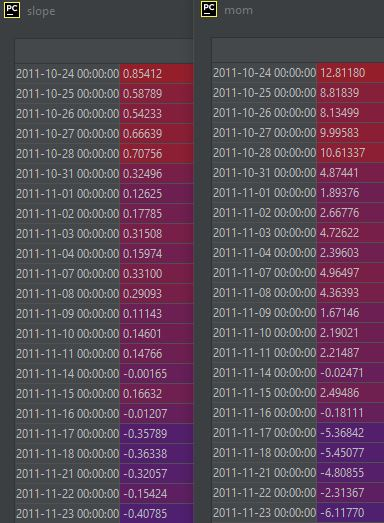
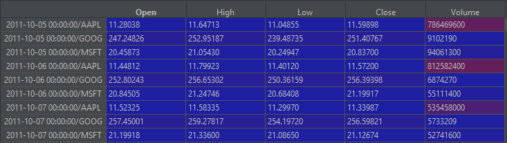

<p align="center">
  <a href="https://github.com/jmrichardson/tuneta">
    
  </a>
</p>

[TuneTA](https://github.com/jmrichardson/tuneta) optimizes technical indicators using a [distance correlation](https://towardsdatascience.com/introducing-distance-correlation-a-superior-correlation-metric-d569dc8900c7) measure to a user defined target feature such as next day return.  Indicator parameter(s) are selected using clustering techniques to avoid "peak" or "lucky" values.  The set of tuned indicators can be pruned by choosing the most correlated with the target while minimizing correlation with each other (based on user defined maximum correlation). TuneTA maintains its state to add all tuned indicators to multiple data sets (train, validation, test).

### Features

* Given financial prices (OHLCV) and a target feature such as return, TuneTA optimizes the parameter(s) of technical indicator(s) using distance correlation to the target feature. Distance correlation captures both linear and non-linear strength and provides significant benefit over the popular Pearson correlation.
* Optimal indicator parameters are selected in a multi-step clustering process to avoid values which are not consistent with neighboring values, providing a more robust parameter selection.
* Prune indicators with a maximum correlation to each other.  This is helpful for machine learning models which generally perform better with lower feature intercorrelation.
* Supports tuning indicator(s) for single or multiple equities.  Multiple equities can be combined into a market basket where indicator parameters are optimized across the entire basket of equities.
* Multiple time ranges (ie: short, medium and long)
* Supports pruning preexisting features
* Persists state to generate identical indicators on multiple datasets (train, validation, test)
* Parallel processing for technical indicator optimization as well as correlation pruning
* Supports technical indicators produced from the following packages:
  * [Pandas TA](https://github.com/twopirllc/pandas-ta)
  * [TA-Lib](https://github.com/mrjbq7/ta-lib)
  * [FinTA](https://github.com/peerchemist/finta)
* Correlation report of target and features
* Early stopping

### Overview

TuneTA simplifies the process of optimizing many technical indicators while avoiding "peak" values, and selecting the best indicators with minimal correlation between each other (optional). At a high level, TuneTA performs the following steps:

1.  For each indicator, [Optuna](https://optuna.org) searches for parameter(s) which maximize its correlation to a user defined target (for example, next day return).
2.  After the specified Optuna trials are complete, a 3-step KMeans clustering method is used to select the optimal parameter(s):

    1. Each trial is placed in its nearest neighbor cluster based on its distance correlation to the target.  The optimal number of clusters is determined using the elbow method.  The cluster with the highest average correlation is selected with respect to its membership.  In other words, a weighted score is used to select the cluster with highest correlation but also with the most trials.
    2. After the best correlation cluster is selected, the parameters of the trials within the cluster are also clustered. Again, the best cluster of indicator parameter(s) are selected with respect to its membership.
    3. Finally, the centered best trial is selected from the best parameter cluster.
    
3.  Optionally, the tuned indicators can be pruned by selecting the indicators with a maximum correlation to the all other indicators.
4.  Finally, TuneTA generates all optimized indicators.
---

### Installation

Install the latest code (recommended):

```python
pip install -U git+https://github.com/jmrichardson/tuneta
```

Install the latest release:

```python
pip install -U tuneta
```

---

### Examples

* [Tune RSI Indicator](#tune-rsi-indicator)
* [Tune Multiple Indicators](#tune-multiple-indicators)
* [Tune and Prune all Indicators](#tune-and-prune-all-indicators)
* [TuneTA fit usage](#tuneta-fit-usage)
* [Tune Market](#tune-market)
* [Prune Existing Features](#prune-existing-features)

### Tune RSI Indicator

For simplicity, lets optimize a single indicator:

* RSI Indicator
* Two time periods (short and long term): 2-30 and 31-180
* Maximum of 500 trials per time period to search for the best indicator parameter
* Stop after 100 trials per time period without improvement

The following is a snippet of the complete example found in the examples directory:

```python
tt = TuneTA(n_jobs=4, verbose=True)
tt.fit(X_train, y_train,
    indicators=['tta.RSI'],
    ranges=[(2, 30), (31, 180)],
    trials=500,
    early_stop=100,
)
```

Two studies are created for each time period with up to 500 trials to test different indicator length values.  The correlation values are displayed based on the trial parameter.  The best trial with its respective parameter value is saved for both time ranges. 

To view the correlation of both indicators to the target return as well as each other:
```python
tt.report(target_corr=True, features_corr=True)
```
```csharp
Indicator Correlation to Target:

                         Correlation
---------------------  -------------
tta_RSI_timeperiod_19       0.23393
tta_RSI_timeperiod_36       0.227434

Indicator Correlation to Each Other:

                         tta_RSI_timeperiod_19    tta_RSI_timeperiod_36
---------------------  -----------------------  -----------------------
tta_RSI_timeperiod_19                  0                        0.93175
tta_RSI_timeperiod_36                  0.93175                  0
```
To generate both RSI indicators on a data set:
```python
features = tt.transform(X_train)
```

```csharp
            tta_RSI_timeperiod_19  tta_RSI_timeperiod_36
Date                                                    
2011-10-03                    NaN                    NaN
2011-10-04                    NaN                    NaN
2011-10-05                    NaN                    NaN
2011-10-06                    NaN                    NaN
2011-10-07                    NaN                    NaN
...                           ...                    ...
2018-09-25              62.173261              60.713051
2018-09-26              59.185666              59.362731
2018-09-27              61.026238              60.210235
2018-09-28              61.094793              60.241806
2018-10-01              63.384824              61.305540
```

### Tune Multiple Indicators

Building from the previous example, lets optimize a handful of indicators:

* Basket of indicators from 3 different packages ([TA-Lib](https://github.com/mrjbq7/ta-lib), [Pandas-TA](https://github.com/twopirllc/pandas-ta), [FinTA](https://github.com/peerchemist/finta))
* One time period: 2-60

```python
tt.fit(X_train, y_train,
    indicators=['pta.slope', 'pta.stoch', 'tta.MACD', 'tta.MOM', 'fta.SMA'],
    ranges=[(2, 60)],
    trials=500,
    early_stop=100,
)
```

You can view how long it took to optimize each indicator:
```python
tt.fit_times()
```
```csharp
    Indicator      Times
--  -----------  -------
 1  pta.stoch      23.56
 0  tta.MACD       12.03
 2  pta.slope       6.82
 4  fta.SMA         6.42
 3  tta.MOM         5.7
```

Let's have a look at each indicator's distance correlation to target as well as each other:
```python
    tt.report(target_corr=True, features_corr=True)
```
```csharp
Indicator Correlation to Target:
                                                       Correlation
---------------------------------------------------  -------------
tta_MACD_fastperiod_43_slowperiod_4_signalperiod_52       0.236575
pta_stoch_k_57_d_29_smooth_k_2                            0.231091
pta_slope_length_15                                       0.215603
tta_MOM_timeperiod_15                                     0.215603
fta_SMA_period_30                                         0.080596

Indicator Correlation to Each Other:
                                                       tta_MACD_fastperiod_43_slowperiod_4_signalperiod_52    pta_stoch_k_57_d_29_smooth_k_2    pta_slope_length_15    tta_MOM_timeperiod_15    fta_SMA_period_30
---------------------------------------------------  -----------------------------------------------------  --------------------------------  ---------------------  -----------------------  -------------------
tta_MACD_fastperiod_43_slowperiod_4_signalperiod_52                                               0                                 0.886265               0.779794                 0.779794             0.2209
pta_stoch_k_57_d_29_smooth_k_2                                                                    0.886265                          0                      0.678311                 0.678311             0.110129
pta_slope_length_15                                                                               0.779794                          0.678311               0                        1                    0.167069
tta_MOM_timeperiod_15                                                                             0.779794                          0.678311               1                        0                    0.167069
fta_SMA_period_30                                                                                 0.2209                            0.110129               0.167069                 0.167069             0

```

Notice above that both slope(15) and mom(15) are perfectly correlated in the intercorrelation report (indicated by value of 1) as well as having the same correlation to the target.  Initially, I thought this had to be a bug, but they are indeed identically correlated on a different scale (notice the same heat color coding):



Lets remove correlated indicators with a maximum threshold of .85 for demonstration purposes. Based on the above correlation report, the two indicator pairs that have a correlation of greater than .85 are MACD/Stoch and Slope/Mom.  We can easily remove the worst correlated to the target of each pair (removes Stoch as MACD is more correlated to the target and either slope or mom can be removed as they are both identically correlated to the target).  Notice that all indicators now have an intercorrelation less than .85:

```python
tt.prune(max_correlation=.85)
```
```csharp
Indicator Correlation to Target:
                                                       Correlation
---------------------------------------------------  -------------
tta_MACD_fastperiod_43_slowperiod_4_signalperiod_52       0.236576
pta_slope_length_15                                       0.215603
fta_SMA_period_6                                          0.099375
Indicator Correlation to Each Other:
                                                       tta_MACD_fastperiod_43_slowperiod_4_signalperiod_52    pta_slope_length_15    fta_SMA_period_6
---------------------------------------------------  -----------------------------------------------------  ---------------------  ------------------
tta_MACD_fastperiod_43_slowperiod_4_signalperiod_52                                               0                      0.779794            0.252834
pta_slope_length_15                                                                               0.779794               0                   0.188658
fta_SMA_period_6                                                                                  0.252834               0.188658            0
Backend TkAgg is interactive backend. Turning interactive mode on.

```

As in the previous example, we can easily create features:

```python
features = tt.transform(X_train)
```

### Tune and Prune all Indicators

Building from the previous examples, lets optimize all available indicators:

```python
tt.fit(X_train, y_train,
    indicators=['all'],
    ranges=[(2, 30)],
    trials=500,
    early_stop=100,
)
```
As in the previous examples we can see the correlation to the target with the report function:

```python
tt.report(target_corr=True, features_corr=False)
```
For brevity, only showing the top 10 of the many results:
```csharp
Indicator Correlation to Target:
                                                                              Correlation
--------------------------------------------------------------------------  -------------
pta_natr_length_4_scalar_27                                                      0.253049
tta_NATR_timeperiod_6                                                            0.247999
tta_MACD_fastperiod_3_slowperiod_29_signalperiod_25                              0.240217
pta_macd_fast_3_slow_29_signal_25                                                0.240217
pta_pgo_length_26                                                                0.239584
pta_tsi_fast_28_slow_2_signal_25_scalar_15                                       0.238303
pta_smi_fast_29_slow_2_signal_20_scalar_26                                       0.238294
fta_TSI_long_3_short_29_signal_26                                                0.234654
tta_RSI_timeperiod_19                                                            0.23393
pta_rsi_length_19_scalar_26                                                      0.23393
...
```

Let's prune the indicators to have a maximum of .7 correlation with any of the other indicators:

```python
tt.prune(max_correlation=.7)
```
Show the correlation for both target and intercorrelation after prune:
```python
tt.report(target_corr=True, features_corr=True)
```
Again, showing only top 10 rows of each for brevity (intercorrelation omitted as well):
```csharp
                                                       Correlation
---------------------------------------------------  -------------
pta_natr_length_4_scalar_27                               0.253049
tta_MACD_fastperiod_3_slowperiod_29_signalperiod_25       0.240217
pta_pvol_                                                 0.199302
pta_kc_length_3_scalar_27                                 0.193162
fta_VZO_period_20                                         0.171986
fta_DMI_period_4                                          0.148614
pta_pvo_fast_27_slow_28_signal_29_scalar_15               0.14692
pta_cfo_length_28_scalar_26                               0.141013
fta_IFT_RSI_rsi_period_28_wma_period_4                    0.140977
pta_stc_fast_18_slow_27                                   0.140789
...
```

### Tune Market

TuneTA supports tuning indicators across a market of equities. Simply, index the input dataframe with the date and symbol similar to the following.  Notice the dataframe still contains OHLCV but is indexed by both date and symbol (see tune_market.py in examples folder):



Use TuneTA in the same way as the previous examples


### Prune Existing Features

If you have preexisting features in your dataframe (regardless if you use TuneTA to create new ones), I've added a helper prune_df function to prune the all of the features based on intercorrelation.  This is helpful, for example, if you have custom features that you would like to combine with TuneTA and select only the features with maximum correlation with minimal intercorrelation.  The prune_df helper function takes a dataframe and returns the column names of the appropriate features to keep.  The column names can then be used to filter your datasets:

```python
# Features to keep
feature_names = tt.prune_df(X_train, y_train, max_correlation=.7, report=False)

# Filter datasets
X_train = X_train[feature_names]
X_test = X_test[feature_names]
```

See prune_dataframe.py in the examples folder


### TuneTA fit usage

tt.fit(X, y, indicators, ranges, trials, early_stop)

Parameters:

* indicators: List of indicators to optimize
    * ['all']: All indicators
    * ['pta']: All pandas-ta indicators
    * ['tta']: All ta-lib indicators
    * ['fta']: All fin-ta indicators
    * ['tta.RSI']: RSI indicator from ta-lib
    * See config.py for available indicators and the parameters that are optimized
* ranges: Time periods to optimize
    * [(2-30)]: Single time period (2 to 30 days)
    * [(2-30, 31-90)]: Two time periods (short and long term)
* trials: Number of trials to search for optimal parameters
* early_stop: Max number of trials without improvement

---


